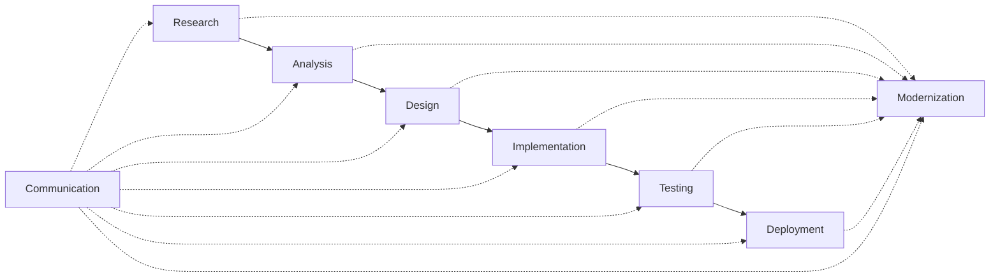
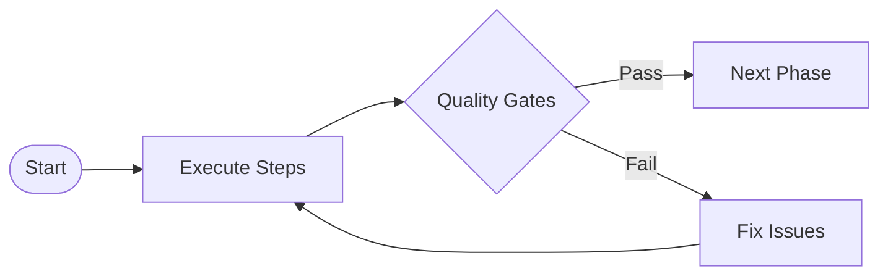
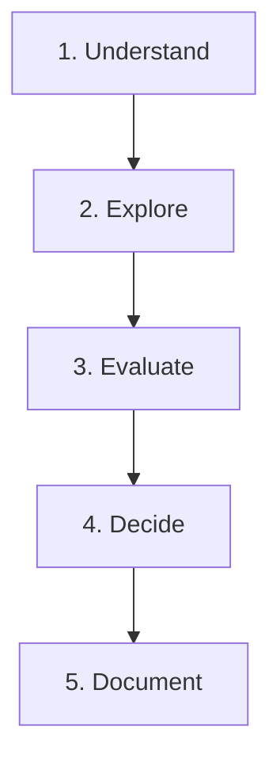
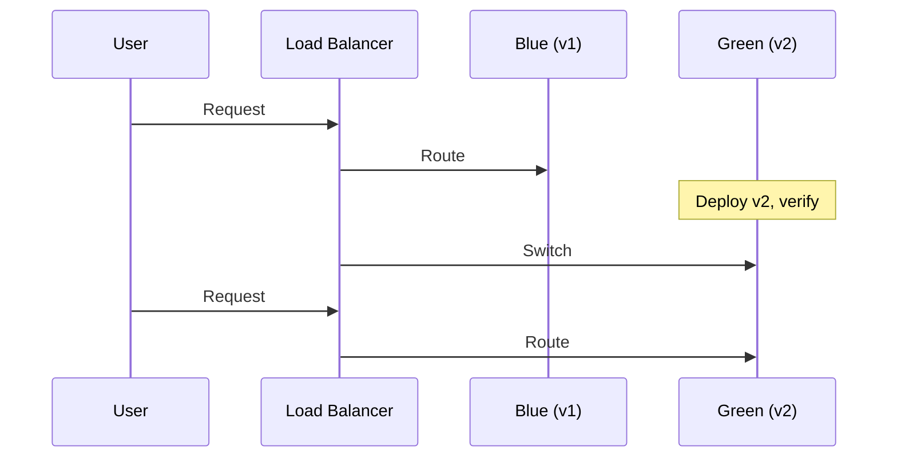
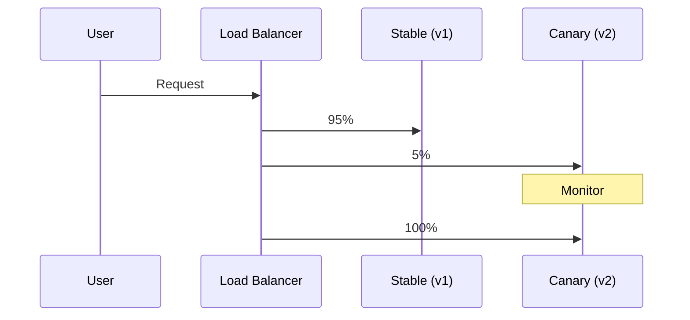
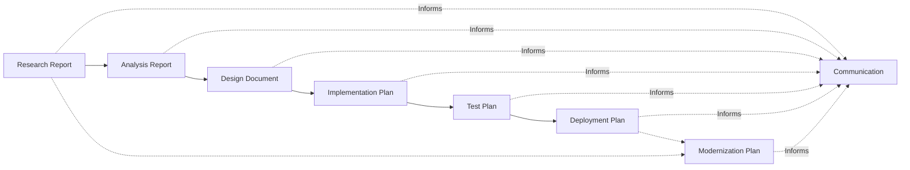
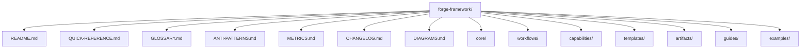

# Diagrams & Visual Reference - Forge Engineering Lifecycle Framework

## SDLC Workflow Overview

## Phase Flow Patterns

### Linear Flow

### Iterative Flow

## Quality Gate Flow

## Decision-Making Framework

## Deployment Strategies

### Blue-Green Deployment

### Canary Deployment

## Artifact Relationship Map

## Framework File Structure

