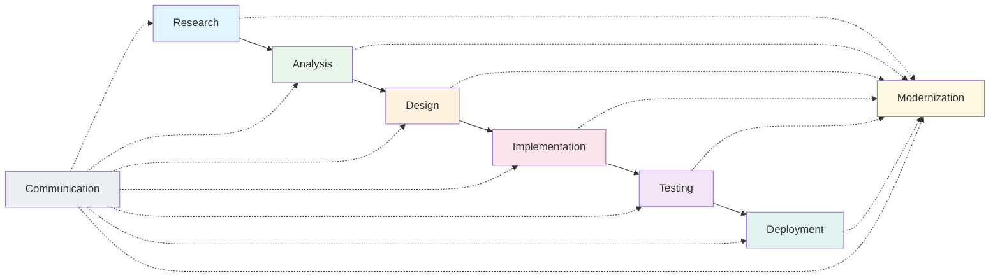
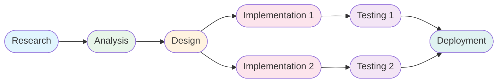
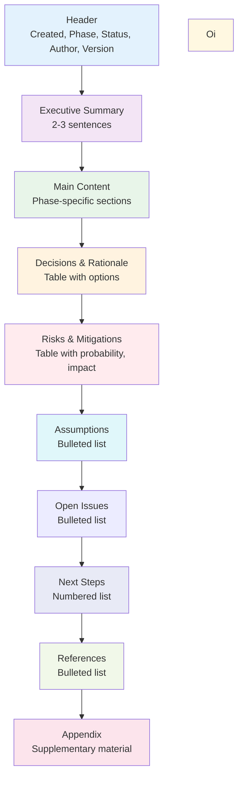
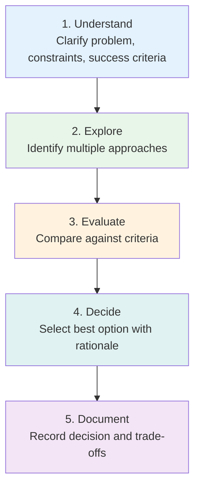
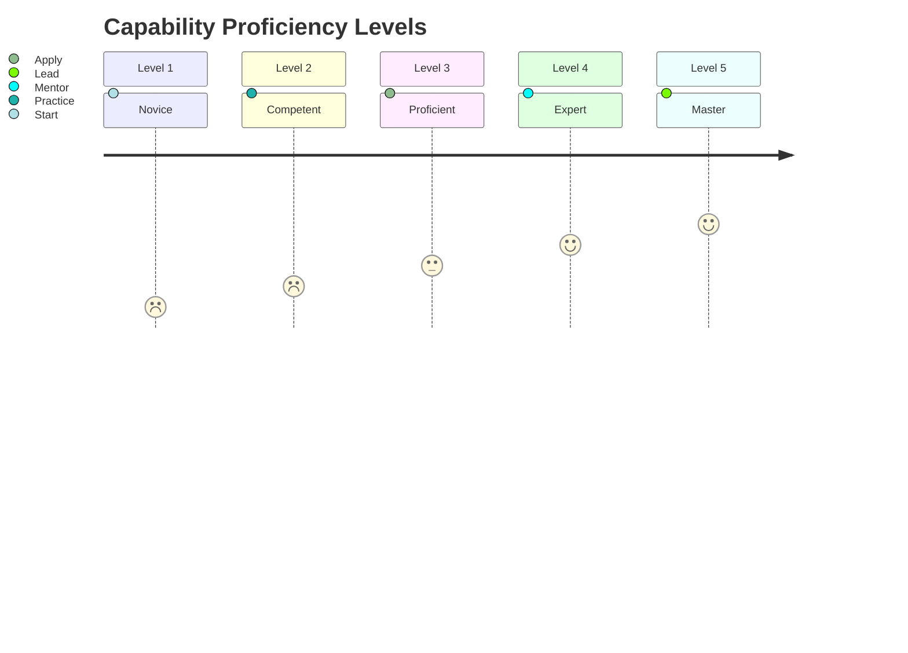
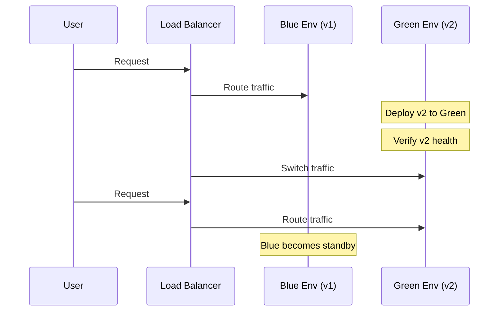
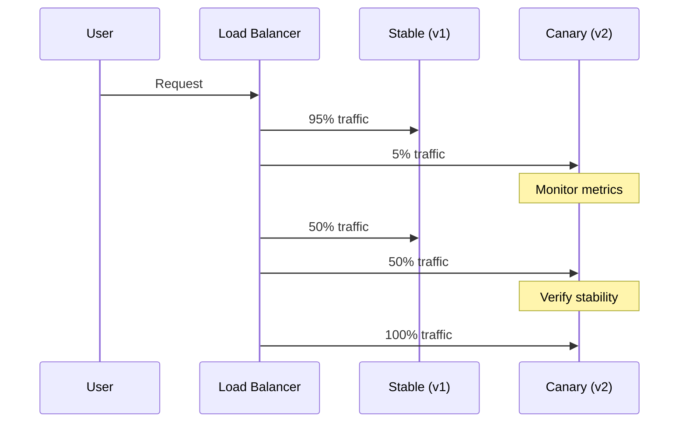
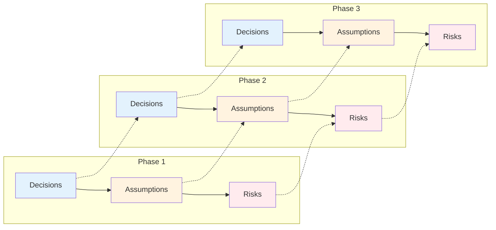
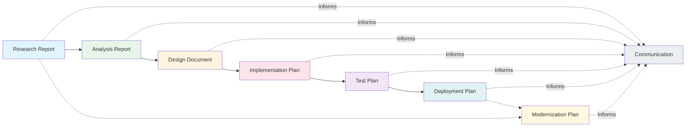

# Diagrams & Visual Reference - Forge Engineering Lifecycle Framework

## Overview

This document provides visual diagrams for key concepts in the Forge framework. These diagrams use Mermaid syntax (supported by GitHub Markdown) and ASCII art.

## SDLC Workflow Overview



## Phase Flow Patterns

### Linear Flow (Full Lifecycle)


### Iterative Flow


### Parallel Flow (Multiple Teams)



## Artifact Output Format



## Quality Gate Flow

```mermaid
flowchart LR
    Start([Start Phase]) --> Execute[Execute Steps]
    Execute --> QG{Quality Gates}
    QG -->|Pass| Next[Next Phase]
    QG -->|Fail| Fix[Fix Issues]
    Fix --> Execute

    style Start fill:#e8f5e9
    Execute fill:#e3f2fd
    QQ fill:#fff3e0
    Next fill:#e0f2f1
    Fix fill:#ffebee
```

## Decision-Making Framework



## Proficiency Level Progression



## Deployment Strategies

### Blue-Green Deployment



### Canary Deployment



## Context Preservation Model



## Artifact Relationship Map



## Framework File Structure

```mermaid
graph TD
    ROOT[forge-framework/]
    ROOT --> README[README.md]
    ROOT --> QR[QUICK-REFERENCE.md]
    ROOT --> GLOSSARY[GLOSSARY.md]
    ROOT --> ANTI[ANTI-PATTERNS.md]
    ROOT --> METRICS[METRICS.md]
    ROOT --> CHANGELOG[CHANGELOG.md]
    ROOT --> DIAGRAMS[DIAGRAMS.md]
    ROOT --> CORE[core/]
    ROOT --> WORKFLOWS[workflows/]
    ROOT --> CAPABILITIES[capabilities/]
    ROOT --> TEMPLATES[templates/]
    ROOT --> ARTIFACTS[artifacts/]
    ROOT --> GUIDES[guides/]
    ROOT --> EXAMPLES[examples/]

    CORE --> SP[system-prompt.md]
    CORE --> P[persona.md]
    CORE --> PR[principles.md]

    WORKFLOWS --> W1[01-research.md]
    WORKFLOWS --> W2[02-analyze.md]
    WORKFLOWS --> W3[03-design.md]
    WORKFLOWS --> W4[04-implement.md]
    WORKFLOWS --> W5[05-test.md]
    WORKFLOWS --> W6[06-debug.md]
    WORKFLOWS --> W7[07-deploy.md]
    WORKFLOWS --> W8[08-modernize.md]
    WORKFLOWS --> W9[09-communication.md]

    CAPABILITIES --> C1[research.md]
    CAPABILITIES --> C2[analysis.md]
    CAPABILITIES --> C3[design.md]
    CAPABILITIES --> C4[implementation.md]
    CAPABILITIES --> C5[testing.md]
    CAPABILITIES --> C6[debugging.md]
    CAPABILITIES --> C7[deployment.md]
    CAPABILITIES --> C8[modernization.md]

    TEMPLATES --> T1[research-report.md]
    TEMPLATES --> T2[analysis-report.md]
    TEMPLATES --> T3[design-document.md]
    TEMPLATES --> T4[implementation-plan.md]
    TEMPLATES --> T5[test-plan.md]
    TEMPLATES --> T6[debug-report.md]
    TEMPLATES --> T7[deployment-plan.md]
    TEMPLATES --> T8[modernization-plan.md]

    ARTIFACTS --> OF[output-format.md]

    GUIDES --> IG[integration-guide.md]
    GUIDES --> CG[configuration-guide.md]
    GUIDES --> TG[troubleshooting.md]

    EXAMPLES --> EX1[research-report-example.md]

    style ROOT fill:#eceff1
    style README fill:#e3f2fd
    style CORE fill:#e8f5e9
    style WORKFLOWS fill:#fff3e0
    style CAPABILITIES fill:#fce4ec
    style TEMPLATES fill:#f3e5f5
    style ARTIFACTS fill:#e0f2f1
    style GUIDES fill:#fff8e1
    style EXAMPLES fill:#e1f5fe
```


