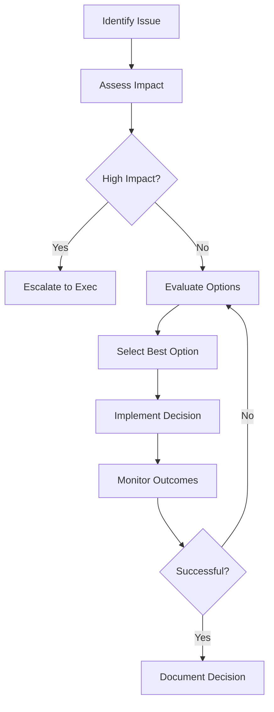

# Cross-Team Collaboration Guide - Forge Engineering Lifecycle Framework

## Overview
This guide provides frameworks, tools, and best practices for effective cross-team collaboration when using the Forge Engineering Lifecycle Framework, ensuring seamless coordination across development, security, operations, and business teams.

## Collaboration Principles

### 1. Shared Responsibility
All teams share responsibility for:
- **Quality Assurance**: Collective ownership of system quality
- **Security**: Security as everyone's responsibility
- **Reliability**: System uptime and performance
- **User Experience**: Customer-focused outcomes
- **Innovation**: Driving improvement and best practices

### 2. Transparent Communication
- **Regular Syncs**: Scheduled cross-team meetings
- **Shared Dashboards**: Real-time visibility into progress
- **Open Channels**: Slack/Discord channels for each domain
- **Documentation**: Centralized knowledge sharing
- **Feedback Loops**: Structured feedback mechanisms

### 3. Integrated Workflows
- **Unified Backlog**: Shared prioritization across teams
- **Cross-Team Reviews**: Joint code/design reviews
- **Shared Quality Gates**: Common acceptance criteria
- **Integrated CI/CD**: Single pipeline with multi-team ownership

### 4. Collaborative Culture
- **Psychological Safety**: Safe environment for ideas/ideas
- **Mutual Respect**: Recognition of different expertise
- **Knowledge Sharing**: Regular knowledge transfer sessions
- **Continuous Learning**: Joint learning and improvement

## Team Roles and Responsibilities

### Core Development Team
**Primary Responsibilities**:
- Code development following Forge workflows
- Unit testing and integration testing
- Documentation creation (workflows 15, 27)
- Implementation (workflow 04)

**Collaboration Touch Points**:
- **Design Reviews**: Participate in architecture reviews (03)
- **Security Reviews**: Coordinate with security team (10)
- **Code Reviews**: Participate in joint reviews (13)
- **Testing**: Coordinate test execution (05)
- **Deployment**: Coordinate releases (07)

### Security Team
**Primary Responsibilities**:
- Security assessments (workflow 10)
- Vulnerability management (workflow 77)
- Compliance auditing (workflows 22, 73, 74)
- Incident response (workflow 12)
- Penetration testing (workflow 61)

**Collaboration Touch Points**:
- **Threat Modeling**: Early in design phase (02, 03)
- **Code Reviews**: Include security considerations (13)
- **Static Analysis**: Configure and tune SAST tools (77)
- **Dependency Management**: Review third-party dependencies (77)
- **Incident Response**: Coordinate with DevOps (12)

### Operations/SRE Team
**Primary Responsibilities**:
- Infrastructure management (workflow 47, 48)
- Monitoring and observability (workflow 24)
- Deployment automation (workflow 07)
- Incident response (workflow 46)
- Performance optimization (workflow 11)

**Collaboration Touch Points**:
- **Infrastructure Design**: Participate in architecture discussions (03)
- **Deployment Planning**: Coordinate release schedules (17, 07)
- **Monitoring Setup**: Implement observability (37)
- **Performance Testing**: Validate performance requirements (11)
- **Capacity Planning**: Forecast infrastructure needs (25)

### Product/Business Team
**Primary Responsibilities**:
- Requirements definition (workflow 02)
- Stakeholder management (workflow 25)
- Change management (workflow 26)
- Project planning (workflow 14)
- Communication (workflow 09)

**Collaboration Touch Points**:
- **Requirements Review**: Validate analysis outputs (02)
- **Design Approval**: Review architecture decisions (03)
- **Release Planning**: Coordinate release schedules (17)
- **Go-to-Market**: Align on communication strategies (09)
- **Success Metrics**: Define and track KPIs (52)

### Quality Assurance Team
**Primary Responsibilities**:
- Test strategy and planning (workflow 05)
- Quality assurance (workflow 18)
- Automated testing
- Defect tracking and management
- Quality gate definition

**Collaboration Touch Points**:
- **Requirements Review**: Ensure testability (02)
- **Design Reviews**: Validate testability aspects (03)
- **Implementation**: Coordinate on testability features (04)
- **Testing**: Execute coordinated testing (05)
- **Code Reviews**: Include QA perspectives (13)

## Communication Protocols

### Meeting Cadence

#### Weekly Cross-Team Sync
**Participants**: Representatives from all teams
**Duration**: 60 minutes
**Agenda**:
1. **Progress Updates** (15 min)
   - Development progress
   - Testing status
   - Security findings
   - Operational readiness

2. **Blockers & Dependencies** (15 min)
   - Cross-team blockers
   - Dependency identification
   - Resource constraints

3. **Upcoming Milestones** (15 min)
   - Release schedule
   - Security reviews
   - Deployment windows

4. **Risk Discussion** (10 min)
   - High-priority risks
   - Mitigation status
   - Escalation needs

5. **Action Items** (5 min)
   - Assigned actions
   - Due dates
   - Follow-up mechanisms

#### Daily Standups (Per Team)
**Participants**: Team members
**Duration**: 15 minutes
**Focus**: 
- What was completed yesterday?
- What will be done today?
- Any blockers?

#### Bi-Weekly Deep-Dives
**Participants**: Subject matter experts
**Duration**: 90 minutes
**Topics**:
- Architecture deep-dives
- Security analysis
- Performance optimization
- Testing strategy refinement

### Communication Channels
| Purpose | Tool | Participants | SLA |
|---------|------|--------------|-----|
| Urgent Issues | Slack Emergency | All teams | 15 min |
| Daily Coordination | Slack Channels | Team reps | 2 hours |
| Document Sharing | Confluence/Wiki | All teams | Real-time |
| Formal Decisions | Email/Messaging | Decision makers | 4 hours |
| Incident Response | PagerDuty/SMS | Incident teams | 5 min |
| Project Updates | Status reports | Management | Daily |

## Integration Points Mapping

### Research → Security Integration
```
[Research Workflow 01] → [Security Workflow 10]
Output:  • Threat landscape analysis
        • Technology risk assessment
        • Security implications identified
        • Recommendations for secure tech stack

Integration Points:
• Security requirements during technology evaluation
• Vulnerability assessment planning
• Security tool recommendations
• Risk mitigation strategy alignment
```

### Design → Implementation → Testing Integration
```
[Design Workflow 03] → [Implementation 04] → [Testing 05]
Output:   • Detailed architecture
          • Technical specifications
          • Code implementation
          • Unit/integration tests
          • Test execution results

Integration Points:
• Clear requirements for implementation
• Coding standards and conventions
• Testability requirements
• Code review criteria
```

### Implementation → Security → Testing Integration
```
[Implementation 04] → [Security 10] → [Testing 05]
Output: • Secure code
          • Security scan results
          • Remediated vulnerabilities
          • Secure test cases

Integration Points:
• Static analysis integration in CI/CD
• Security code review
• Secure coding guidelines
• Vulnerability remediation
```

## Conflict Resolution Framework

### Conflict Types
| Type | Examples | Resolution Approach |
|------|----------|-------------------|
| **Technical** | Architecture disagreements, tool selection | Technical review board |
| **Priority** | Feature vs. security, speed vs. quality | Product management |
| **Resource** | Team availability, budget constraints | Leadership escalation |
| **Process** | Workflow disagreement, procedure conflicts | Process owner |

### Conflict Resolution Process

#### Step 1: Local Resolution
1. Identify conflict participants
2. Understand different perspectives
3. Find common ground
4. Document resolution attempt

#### Step 2: Escalation to Team Leads
1. Present conflict to relevant team leads
2. Facilitated discussion
3. Agree on resolution approach
4. Document decision

#### Step 3: Cross-Team Escalation
1. Present to cross-team leads group
2. Use decision framework:
   - Impact assessment
   - Risk evaluation
   - Cost-benefit analysis
   - Timeline considerations
3. Make decision with stakeholder input
4. Document resolution

#### Step 4: Executive Escalation
1. Present to executive leadership
2. Use executive decision framework
3. Make final binding decision
4. Communicate decision broadly

### Decision-Making Framework


## Knowledge Sharing

### Regular Knowledge Sharing Sessions
| Session Type | Frequency | Participants | Purpose |
|--------------|-----------|--------------|---------|
| **Tech Talks** | Weekly | All technical teams | Share technical insights |
| **Security Spotlight** | Bi-weekly | Security + Dev teams | Security awareness |
| **Ops Learning** | Bi-weekly | Operations + Dev teams | Operations best practices |
| **Cross-Training** | Monthly | All teams | Skill transfer |
| **Lessons Learned** | Monthly | All teams | Process improvement |

### Knowledge Base Structure
```
Knowledge Base/
├── Architecture/
├── Security/
├── Operations/
├── Testing/
├── DevOps/
├── Best Practices/
├── Case Studies/
└── Troubleshooting/
```

### Documentation Standards
- **Single Source of Truth**: Centralized documentation
- **Regular Updates**: Keep docs current
- **Searchable**: Easy access to information
- **Version Controlled**: Track changes
- **Accessible**: Available to all teams

## Cross-Team Workflow Integration

### Security Integration in Development
1. **Threat Modeling**: Security team participates in design reviews
2. **Static Analysis**: Security tools integrated in CI/CD pipeline
3. **Dependency Scanning**: Automated dependency security checks
4. **Code Review**: Security considerations in code reviews
5. **Dynamic Testing**: Security testing during QA phase

### Operations Integration in Development
1. **Infrastructure as Code**: Operations in version control
2. **Monitoring Design**: Observability designed into systems
3. **Deployment Automation**: Automated deployment processes
4. **Capacity Planning**: Shared performance requirements
5. **Runbooks**: Operations documentation accessible

### Product Integration in Technical Work
1. **User Stories**: Clear requirements with acceptance criteria
2. **Prioritization**: Joint prioritization of features and tech debt
3. **Release Planning**: Coordinated release schedules
4. **Feedback Loops**: Regular user feedback integration
5. **Success Metrics**: Shared definition of success

## Tools and Platforms

### Collaboration Tools
| Tool | Purpose | Integration Points |
|------|---------|-------------------|
| **Slack/Microsoft Teams** | Real-time communication | All teams |
| **Jira/Trello** | Task and project management | Development, QA, Product |
| **Confluence/Notion** | Documentation and knowledge base | All teams |
| **GitHub/GitLab** | Code collaboration | Development, Security |
| **PagerDuty/Opsgenie** | Incident response | Operations, DevOps |

### Shared Dashboards
1. **Deployment Dashboard**: Track deployments across services
2. **Security Dashboard**: Monitor vulnerabilities and threats
3. **Performance Dashboard**: System performance and reliability
4. **Quality Dashboard**: Testing coverage and defect trends
5. **Business Dashboard**: User metrics and business KPIs

### Integration Platforms
- **CI/CD Integration**: Unified pipeline for all teams
- **Monitoring Integration**: Centralized observability platform
- **Security Integration**: Security tools integrated into development workflow
- **Communication Integration**: Slack/teams bots for notifications

## Cross-Team Rituals

### Sprint Ceremonies
- **Sprint Planning**: Joint prioritization of features and tech debt
- **Daily Standups**: Team-specific, with cross-team sync as needed
- **Sprint Review**: Demo features to all stakeholders
- **Sprint Retrospective**: Identify cross-team improvement opportunities

### Release Ceremonies
- **Release Planning**: Joint release planning and coordination
- **Feature Freeze**: Align on freeze dates and criteria
- **Release Readiness**: Joint validation of release criteria
- **Post-Release Retro**: Joint retrospective on release process

### Milestone Ceremonies
- **Milestone Planning**: Joint milestone definition and planning
- **Milestone Review**: Joint milestone review and demo
- **Milestone Retro**: Joint retrospective on milestone delivery

## Escalation Procedures

### Level 1 - Team Level
- **When to Escalate**: Team-to-team coordination issues
- **Who to Contact**: Team leads
- **Response Time**: 2 hours
- **Documentation**: Team-level issue tracker

### Level 2 - Management Level
- **When to Escalate**: Team-level resolution failed
- **Who to Contact**: Engineering managers
- **Response Time**: 24 hours
- **Documentation**: Management escalation log

### Level 3 - Executive Level
- **When to Escalate**: Management-level resolution failed
- **Who to Contact**: CTO, VPs
- **Response Time**: 48 hours
- **Documentation**: Executive summary report

### Crisis Escalation
- **When to Escalate**: Production incidents, security breaches
- **Who to Contact**: On-call lead → Engineering leadership → Executives
- **Response Time**: 15 minutes
- **Documentation**: Incident report

## Success Metrics

### Cross-Team Collaboration Metrics
| Metric | Target | Measurement |
|--------|--------|-------------|
| Cross-team issue resolution time | <4 hours | Issue tracking |
| Meeting effectiveness score | >4/5 | Survey results |
| Knowledge sharing participation | >80% | Attendance records |
| Cross-team conflict resolution | 100% resolved | Resolution tracking |
| Joint deliverable success rate | >95% | Delivery metrics |

### Communication Metrics
| Metric | Target | Measurement |
|--------|--------|-------------|
| Response time to urgent messages | <15 min | Communication logs |
| Meeting action item completion | >90% | Action item tracking |
| Documentation update frequency | Weekly | Version history |
| Knowledge base search success rate | >95% | Search analytics |

### Integration Metrics
| Metric | Target | Measurement |
|--------|--------|-------------|
| Cross-team dependency resolution | >95% | Dependency tracking |
| Joint quality gate pass rate | >90% | Review records |
| Security finding resolution time | <48 hours | Security ticketing |
| Deployment success rate | >95% | Deployment logs |

## Continuous Improvement

### Regular Assessment
- **Monthly**: Team satisfaction survey
- **Quarterly**: Process effectiveness review
- **Annually**: Comprehensive collaboration assessment

### Improvement Framework
1. **Identify**: Collect feedback and metrics
2. **Analyze**: Root cause analysis of issues
3. **Prioritize**: Rank improvements by impact
4. **Implement**: Execute high-priority improvements
5. **Measure**: Track improvement effectiveness
6. **Iterate**: Repeat process

### Feedback Mechanisms
- **Surveys**: Regular team surveys
- **Retrospectives**: Joint retrospectives
- **One-on-Ones**: Individual feedback sessions
- **Metrics**: Quantitative performance data
- **Observability**: Monitoring and alerting data

## Conclusion

Effective cross-team collaboration is essential for successful implementation of the Forge Engineering Lifecycle Framework. By establishing clear roles, communication protocols, conflict resolution mechanisms, and continuous improvement processes, teams can work together seamlessly to deliver high-quality, secure, and reliable software.

The key to success is:
1. **Clear Communication**: Regular, transparent, and structured communication
2. **Shared Goals**: Aligned objectives and success metrics
3. **Mutual Respect**: Recognition of different expertise and perspectives
4. **Process Integration**: Seamless integration of different team processes
5. **Continuous Learning**: Regular knowledge sharing and improvement

By following this cross-team collaboration guide, organizations can maximize the effectiveness of the Forge Framework while building a collaborative culture that drives innovation and excellence.